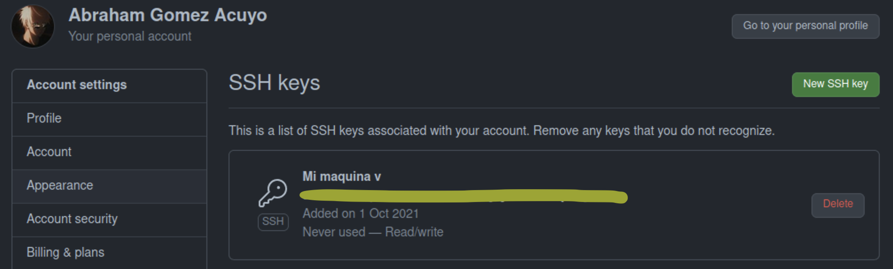

# Documentación hito 0

El hito 0 trata sobre la puesta en marcha de las herramientas necesarias para el desarrollo de un proyecto. Se usa Git y Github. Aparte de crear una cuenta en Github y realizar la configuración sugerida tenemos que realizar los siguientes pasos para proporcionar más seguridad en nuestro trabajo:

## Añadir una clave pública a GitHub

Hay que crear un par de claves pública/privada y añadir la privada al agente ssh y la pública a GitHub:


Añadimos a nuestro agente ssh la clave privada:

```console
usuario@localhost:~$ ssh-add ~/.ssh/id_rsa
```

Copiamos la clave pública

```console
user@localhost:~$ clip < ~/.ssh/id_rsa.pub
```

Y la pegamos en GitHub:



Para comprobar la conexión tendríamos que introducir en un terminal:

```console
user@localhost:~$ ssh -T git@github.com 
```
Y si todo salió bien, nos aparecería el siguiente mensaje

```console
user@localhost:~$
Hi user! You've successfully authenticated, but GitHub does not provide shell access.
```
